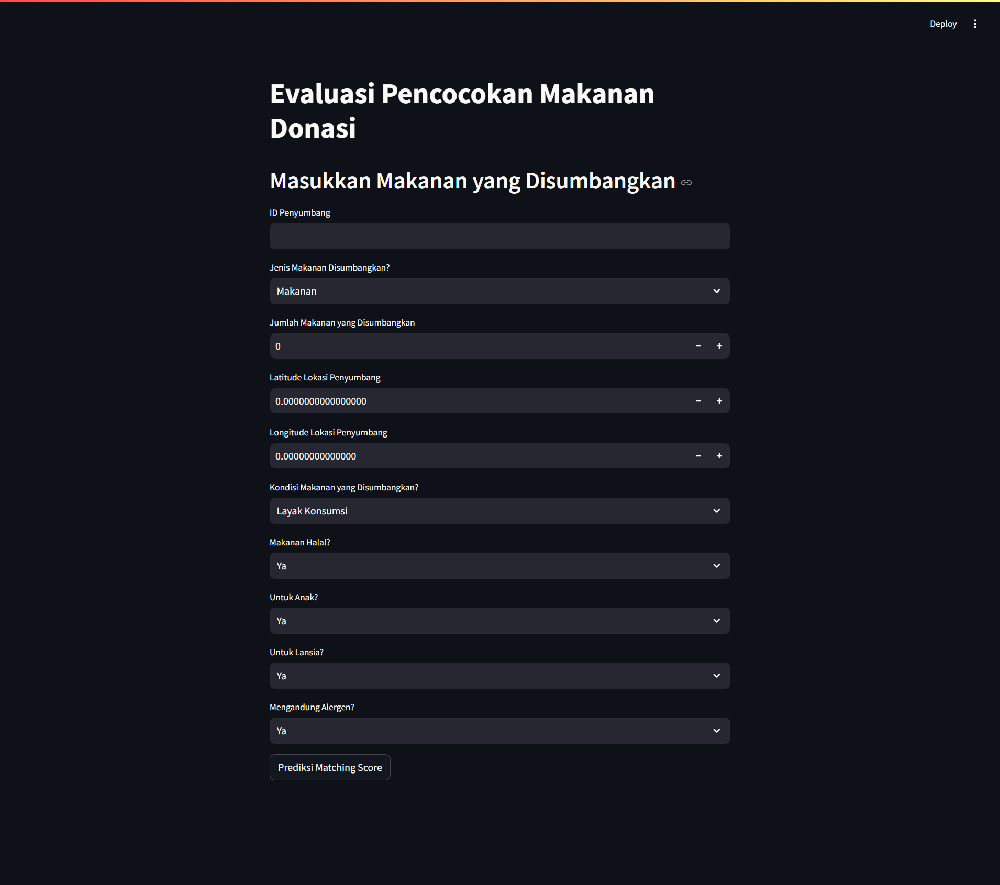
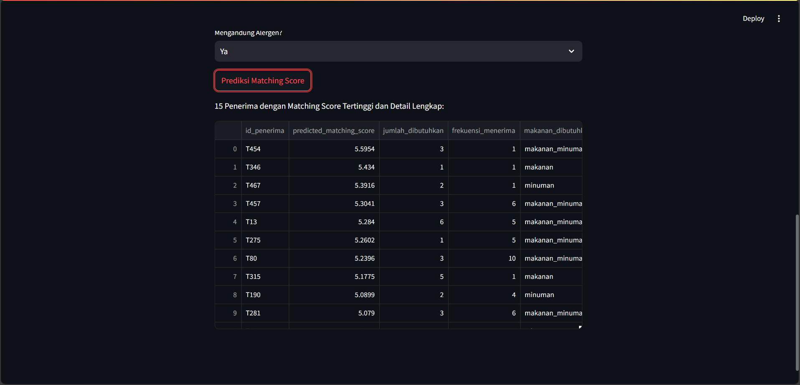

# Model AI SafeFood

**SafeFood** adalah aplikasi yang dirancang untuk membantu menyocokkan makanan yang disumbangkan dengan penerima yang membutuhkan berdasarkan beberapa faktor seperti jumlah, kondisi makanan, lokasi, dan kebutuhan khusus penerima. Aplikasi ini menggunakan model machine learning untuk memberikan skor kecocokan antara makanan yang disumbangkan dan penerima.

## Fitur Utama

- Memasukkan data makanan yang disumbangkan, termasuk jumlah, kondisi, dan informasi lainnya.
- Menyocokkan makanan yang disumbangkan dengan penerima yang membutuhkan, berdasarkan berbagai parameter.
- Menampilkan skor kecocokan (matching score) untuk setiap penerima.
- Menyortir penerima berdasarkan skor kecocokan tertinggi.

## Instalasi

Untuk menginstal proyek ini, ikuti langkah-langkah berikut:

### 1. Clone repository:

    git clone https://github.com/aryasetiap/SafeFood-Model.git

### 2. Masuk ke direktori proyek:

    cd SafeFood-Model

### 3. Install dependencies:

    // buat virtual environment
    python -m venv venv

    // Windows
    venv\Scripts\activate
    // Linux/Mac
    source venv/bin/activate

    // install dependencies
    pip install -r requirements.txt

## Penggunaan

Setelah proyek terinstal, Anda dapat menjalankan aplikasi menggunakan Streamlit untuk antarmuka web.

### 1. Pindah ke direktori script

    cd script

### 2. Jalankan Streamlit

    streamlit run 05_Deploy_Streamlit.py

### Input Data

    - ID Penyumbang: ID unik untuk setiap penyumbang.
    - Jenis Makanan Disumbangkan: Pilihan antara 'Makanan', 'Minuman', atau 'Makanan dan Minuman'.
    - Jumlah Makanan yang Disumbangkan: Jumlah makanan yang akan disumbangkan.
    - Kondisi Makanan: Pilihan antara 'Layak Konsumsi', 'Hampir Kadaluarsa', atau 'Tidak Layak Konsumsi'.
    - Lokasi Penyumbang: Latitude dan Longitude lokasi penyumbang.
    - Kebutuhan Khusus: Apakah makanan halal, untuk anak-anak, lansia, atau mengandung alergen.

### Output

    - Matching Score: Skor yang menunjukkan tingkat kecocokan antara makanan yang disumbangkan dan penerima yang membutuhkan.
    - Penerima Terbaik: Daftar 15 penerima dengan matching score tertinggi, ditampilkan bersama detail lengkap.

## Model Machine Learning

    Model yang digunakan dalam aplikasi ini adalah model pembelajaran mesin yang dilatih untuk memprediksi kecocokan antara makanan yang disumbangkan dan penerima. Model ini disimpan dalam format .keras dan digunakan untuk melakukan prediksi berdasarkan input pengguna.

    Model ini dilatih menggunakan dataset penerima dan karakteristik makanan yang disumbangkan, termasuk lokasi, jumlah, kondisi, dan kebutuhan khusus.

## Struktur Proyek

    SafeFood-Model/
    ├── data/
    │   ├── processed/
    │   │   ├── data_for_model.csv
    │   │   ├── test_set.csv
    │   │   ├── training_set.csv
    │   │   └── validation_set.csv
    │   └── raw/
    │       ├── data_donor.csv
    │       ├── data_penerima.csv
    │       └── data_donor_recipient_matching.csv
    ├── models/
    │   ├── safe_food_model.h5
    │   ├── safe_food_model.keras
    │   ├── safe_food_model.tflite
    │   └── tfjs_model/
    │       └── model.json
    ├── notebooks/
    │   ├── 02_Desain_Model_NN.ipynb
    │   ├── 03_Data_Preprocessing.ipynb
    │   └── 04_Desain_Model_NN.ipynb
    ├── script/
    │   ├── 01_Generate_Data.py
    │   ├── 02_Merge_Data.py
    │   └── 05_Deploy_Streamlit.py
    ├── .gitignore
    ├── README.md
    └── requirements.txt

## Authors

- [Arya Setia Pratama 👑](https://github.com/aryasetiap)
